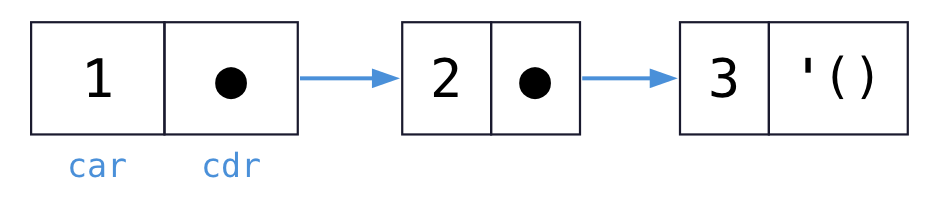

<!-- _class: lead -->

# 程式語言
## Programming Languages — Class 1

政大資碩 115-1　陳家宏

---

# 陳家宏 / Laurence Chen

- IT 顧問、政大兼任助理教授
- Clojure/Datomic 使用者
- 《從試算表到資料平台》作者


---

# 今天三堂課

| 時段 | 內容 |
|---|---|
| 第 1 堂 | Part A：這門課是什麼、怎麼考、怎麼用 AI |
| 第 2 堂 | Part B-1：開發環境 + Lisp 語言初步 |
| 第 3 堂 | Part B-2：EOPL Ch1.1–1.2 歸納資料結構 |

---

<!-- _class: lead -->

# Part A
## 這門課是什麼

---

# 「程式語言」這門課，全世界有兩種常見教法

**路線一：語言比較學**
　代表教科書：Sebesta,《Concepts of Programming Languages》

**路線二：語言建構學**
　代表教科書：Friedman & Wand,《Essentials of Programming Languages》

它們回答**不同的問題**。

---

# 路線一：Sebesta（廣度優先）

- 章節即主題：語法、語意描述、名稱與繫結、資料型別、
  運算式、控制結構、副程式、抽象資料型別、並行、例外、
  函數式語言、邏輯式語言
- 每章橫掃十幾種語言：C / Java / Python / Ada / ML / Prolog…
- 你會知道「Java 的泛型和 C++ 的 template 差在哪」

> 產出：一張**語言特性地圖**。
---

# 路線二：EOPL（深度優先）

- 全書只做一件事：**寫直譯器**
- 一條主線，語言逐層長大：
  `LET → PROC → LETREC → EXPLICIT-REFS → IMPLICIT-REFS`
- 你會知道「closure 到底是什麼」——因為**你把它做出來了**

> 產出：一台**裝在你腦子裡的求值器**。

---

# 兩條路線的對照

| | Sebesta | EOPL |
|---|---|---|
| 提問 | 語言**有哪些**特性？ | 這個特性**怎麼實現**？ |
| 廣度 vs 深度 | 廣 | 窄而深 |
| 產出 | 特性地圖 | 內建求值器 |
| 修完學會 | 選語言、讀語言規格 | Lisp、設計 DSL |

---

# EOPL 有何好處？

1. 前無古人 -> 台灣好像沒有前人這樣子教？
2.  Lisp
3.  與 Programming Language Theory (研究所主題) 連結
4.  了解 Interpreter

---

# 這學期的路線圖

| 週次 | 主題 | 你會做出什麼 |
|---|---|---|
| 1–2 | Ch1 歸納資料結構 | 遞迴程式的推導紀律 |
| 3–4 | Ch2 資料抽象 | 表示法獨立的 ADT |
| 5–8 | Ch3 LET / PROC / LETREC | **第一台直譯器**、closure、範疇 |
| 9 | 期中考 | Ch1–Ch3 |
| 10–12 | Ch4 State | store model、call-by-reference |
| 13–15 | Ch7 型別系統 | type checker |
| 16 | 期末考 | 全範圍 |

---

# 評分方式

<!-- TODO: 依最終決定填入權重 -->

| 項目 | 權重 |
|---|---|
| 作業（6 次） | 50% |
| 期中考 | 20% |
| 期末考 | 30% |
| Functional Thursday 加分 | +3 分 |


---

# 作業設計原則

<!-- TODO: 留白，上課口頭說明 -->

1. 原則上就是課本上的習題。
2. 除非我改變心意，把題目做微調。

---

# 考題設計原則

1. 課本內容
2.   數位學習
3.   上課時補充教材 (通常會是實務面的內容。) 


---

# AI 使用原則

<!-- TODO: 留白，上課口頭說明 -->

**歡迎：**
你看不懂課文，叫 AI 解釋。

**強烈不建議：**
作業你叫 AI 幫你寫。

---

# 課程 requirement：Racket 的 eopl 方言

- 實作語言：**Racket**，且使用 `#lang eopl`
- 六次作業、兩次筆試都以它為準

---

# 為什麼堅持 Racket + eopl 方言

1. **`define-datatype` / `cases`**：課本的語意規則能一對一翻成程式
2. **SLLGEN**：語法剖析器由文法定義自動生成，你不必寫 parser
3. **課本程式碼可直接跑**：作者本人維護的 repo
4. **S-expression 讓「程式即資料」變得顯然**——這正是本課的主題

換語言的代價：你要自己重寫 pattern matching 與 parser，
然後把時間花在**跟課程目標無關的事情**上。

---

# Extra 1：Simple Made Easy

**Rich Hickey, Strange Loop 2011**

- `simple` 的反義詞是 `complex`（交織），不是 `hard`
- `easy` 的反義詞是 `hard`（不熟悉），跟 simple 無關
- 關鍵動詞：**complect** — 把本來分開的東西編在一起
- 「我們用 easy 換來的複雜度，會在後期收利息」

第 1 週～第 8 週之間自行看完，**week 9 考**。

---

# Extra 2：The Value of Values

**Rich Hickey, JaxConf 2012**

- **value** 與 **place** 的分離
- Place-Oriented Programming：以前因為記憶體貴，才這樣子設計。
- 但真實世界的事實不會被覆寫——資訊是**累積**的
- identity = 一連串 value 的時序

第 10 週～第 15 週之間自行看完，**week 16 考**。

---

# 為何選這兩支影片？

* Rich Hickey 是 Clojure 語言的作者 
* 通常只有資深工程師看過…。

連結：`github.com/tallesl/Rich-Hickey-fanclub`

---

# 課外：Functional Thursday

- 台灣的函數式程式設計社群，每月聚會
- 參加 + 繳交一篇心得與活動照片（記得入鏡）→ **期末總分 +3**
- FB：`facebook.com/FunctionalThursday`
- 參與「社群活動」是學習的重要一環。


---

<!-- _class: lead -->

# Part B-1
## 開發環境 + Lisp 語言初步

---

# 你需要準備的四樣東西

| 項目 | 用途 |
|---|---|
| **DrRacket** | IDE + 直譯器 |
| **`#lang eopl`** | 課本使用的 Racket 方言 |
| **eopl3 repo** | 課本全部程式碼 |
| **課本 (電子版／紙本)** | 主線 |

下週上課前，請務必確定上述的四項過關。

---

# 安裝 DrRacket

1. 到 `racket-lang.org` 下載 **Racket（完整版）**
2. 安裝後開啟 **DrRacket**（不是 `racket` 指令列）
3. 驗證 eopl 方言：

```racket
#lang eopl
(display "hello, eopl")
```

若出現找不到 `eopl` 的錯誤：

```bash
raco pkg install eopl
```

---

# DrRacket 介面：兩個窗格

```
┌──────────────────────────────┐
│  Definitions（上）           │  ← 你的程式檔，按 Run 才生效
│  #lang eopl                  │
│  (define (f x) (* x x))      │
├──────────────────────────────┤
│  Interactions（下）= REPL    │  ← 互動測試
│  > (f 5)                     │
│  25                          │
└──────────────────────────────┘
```

**工作流程**：上面寫定義 → Run → 下面試 → 改 → 再 Run。

> REPL 是這門課最重要的工具。**不要用 print debug，請用 REPL 探索。**

---

# `#lang racket` vs `#lang eopl`

同一個 Racket，不同的方言（語言層）。

| | `#lang racket` | `#lang eopl` |
|---|---|---|
| 定位 | 通用語言 | 教學用、課本專用 |
| `define-datatype` | 無 | **有** |
| `cases` | 無 | **有** |
| SLLGEN | 無 | **有** |
| 錯誤訊息 | 一般 | `eopl:error` |

課本所有程式碼都假設 `#lang eopl`。**第一行寫錯，全部不會動。**

---

# eopl 方言給你的三樣東西

```racket
#lang eopl

;; 1. define-datatype: closed sum type
(define-datatype bintree bintree?
  (leaf-node (num integer?))
  (interior-node (key symbol?) (left bintree?) (right bintree?)))

;; 2. cases: exhaustive pattern matching
(define (leaf-sum t)
  (cases bintree t
    (leaf-node (num) num)
    (interior-node (key left right)
      (+ (leaf-sum left) (leaf-sum right)))))

;; 3. sllgen: grammar -> parser (Ch2 之後才用)
```

> 今天先看過就好，Ch2 才正式教。

---

# 課本程式碼：eopl3 repo

```bash
git clone https://github.com/mwand/eopl3.git
```

- Mitchell Wand（課本作者之一）維護
- 目錄依章節分：`chapter1/`, `chapter3/letrec-lang/`, …
- 每個語言都有 `lang.scm` / `interp.scm` / `tests.scm`

---

# 檢查清單（本週要完成）

- [ ] DrRacket 可開啟
- [ ] `#lang eopl` 可執行
- [ ] `eopl3` repo 已 clone，可跑 `chapter1` 的程式

<br>

> 卡住的人，寫 Email 給我。

---

<!-- _class: lead -->

# Lisp 語言初步
## 括號到底在幹嘛

---

# 一切都是 s-expression

**S-expression（符號運算式）只有兩種東西：**

1. **atom**：`42`　`x`　`"hi"`　`#t`
2. **list**：用括號把 s-expression 包起來 `(a b c)`

就這樣。整個語言的語法一頁講完。

```racket
(+ 1 2)              ; a list of 3 atoms
(+ 1 (* 2 3))        ; nested
(define (f x) (* x x))
```

---

# 前綴表示法：為什麼長這樣

| 主流語言 | Racket |
|---|---|
| `1 + 2` | `(+ 1 2)` |
| `f(x, y)` | `(f x y)` |
| `1 + 2 + 3 + 4` | `(+ 1 2 3 4)` |
| `a && b \|\| c` | `(or (and a b) c)` |

**規則**：`(運算子 引數1 引數2 ...)` — **沒有例外**。

好處：
- 沒有運算子優先順序要背
- 沒有「語句 vs 運算式」的區別
- **程式的文字結構 = 語法樹**（這是本課的關鍵）

---

# 程式碼即資料：quote

```racket
(+ 1 2)        ; => 3      被求值
'(+ 1 2)       ; => (+ 1 2)  一個 3 元素的 list！
(car '(+ 1 2)) ; => +
```

`'x` 是 `(quote x)` 的縮寫：**不要求值，當資料看**。

> 為什麼重要？
> 我們整學期都在寫「把程式碼當資料處理」的程式。
> Ch1.2 的 `occurs-free?`、`subst` 收的參數就是 `'(lambda (x) (f x))`。

---

# define 與 lambda

```racket
;; two equivalent forms
(define square (lambda (x) (* x x)))
(define (square x) (* x x))

;; EOPL textbook style: always the lambda form
(define square
  (lambda (x)
    (* x x)))
```

**課本一律用 lambda 形式**，因為它讓「函式是一個值」這件事顯而易見。

```racket
((lambda (x) (* x x)) 5)   ; => 25, anonymous call
```

---

# 區域繫結：let / let*

```racket
(let ([x 5]
      [y 10])
  (+ x y))            ; => 15

(let* ([x 5]
       [y (* x 2)])   ; let* can see earlier bindings
  (+ x y))            ; => 15
```

| 主流語言 | Racket |
|---|---|
| `const x = 5;` | `(let ([x 5]) ...)` |
| 變數的作用域到區塊結束 | **作用域就是 let 的 body** |

> `let` 是 Ch3 第一個要實作的語言 **LET** 的主角。今天先當使用者。

---

# 條件：if / cond

```racket
(if (> x 0) 'positive 'non-positive)   ; if is an EXPRESSION

(cond
  [(> x 0) 'positive]
  [(< x 0) 'negative]
  [else    'zero])
```

注意：`if` **回傳值**，不是控制流程語句。

```racket
(+ 1 (if #t 10 20))    ; => 11
```

真假值：只有 `#f` 是假，**其他全部是真**（包括 `0` 和 `'()`）。

---

# List 操作：cons, car, cdr

```racket
(cons 1 '(2 3))    ; => (1 2 3)     cons
(car '(1 2 3))     ; => 1           first
(cdr '(1 2 3))     ; => (2 3)       rest
(null? '())        ; => #t          empty?
(list 1 2 3)       ; => (1 2 3)
```

`cadr` = `(car (cdr ...))`，`caddr` = 第三個元素。課本大量使用。

```racket
(cadr  '(a b c))   ; => b
(caddr '(a b c))   ; => c
```

---

# cons cell：list 在記憶體裡長什麼樣

```racket
(cons 1 '(2 3))    ; => (1 2 3)
```



- 一個 **cons cell** 就是兩個格子：左邊是 `car`，右邊是 `cdr`
- **list 不是陣列**——它是 cons cell 串成的鏈，`'()` 是鏈的終點
- 所以 `(cons 1 '(2 3))` 得到 `(1 2 3)` 而不是 `((1) 2 3)`：
  `1` 放進 car，**整條舊鏈**原封不動掛在 cdr

> 一格 cell 寫成 `(car . cdr)`，所以 `'(1 2 3)` 的完整寫法是 `'(1 . (2 . (3 . ())))`。
> 這個 `.` 待會在 Part B-2 的 `(Int . List-of-Int)` 還會出現。

---

# 沒有迴圈，只有遞迴

```racket
;; sum a list of numbers
(define list-sum
  (lambda (lst)
    (if (null? lst)
        0                                    ; base case
        (+ (car lst)                         ; first
           (list-sum (cdr lst))))))          ; rest
```

**模式固定**：
1. 空的情況 → 回傳基底值
2. 非空 → 處理 `car`，遞迴處理 `cdr`

> 這個模式在 Ch1.2 會被提升成一套**方法論**：follow the grammar。

---

# 等號家族（新手最容易踩的坑）

| 函式 | 用途 |
|---|---|
| `=` | 只比數字 |
| `eqv?` | 比 symbol、數字、boolean（比身分） |
| `equal?` | 比結構（可以比 list） |

```racket
(eqv? 'a 'a)             ; => #t
(eqv? '(1 2) '(1 2))     ; => #f  ← different objects!
(equal? '(1 2) '(1 2))   ; => #t
```

課本處理變數名（symbol）時一律用 `eqv?`。

---

# Racket ↔ Clojure 對照

| 概念 | Racket | Clojure |
|---|---|---|
| 定義函式 | `(define (f x) ...)` | `(defn f [x] ...)` |
| 匿名函式 | `(lambda (x) ...)` | `(fn [x] ...)` / `#(...)` |
| 區域繫結 | `(let ([x 1]) ...)` | `(let [x 1] ...)` |
| 取首 / 取尾 | `car` / `cdr` | `first` / `rest` |
| 空判斷 | `(null? l)` | `(empty? l)` |
| 真假 | 只有 `#f` 為假 | `false` 與 `nil` 為假 |
| 資料型別 | 以 list 為主 | vector / map 為主 |
| sum type | `define-datatype`（**封閉**） | multimethod / map（**開放**） |

Clojure 教材：https://4clojure.oxal.org/

---

# 函數的命名原則

* CAR = "Contents of the Address Register"
* CDR = "Contents of the Decrement Register"
* Function Name should describe **the purpose**.
* mapcat vs flatMap

---

# S 表達式編輯 - formatting

* 正確的 formatting
* 括弧成對問題
  - 彩虹括弧
  - 括弧自動配對


---

# S 表達式編輯 - IDE 輔助編輯 1

- 括弧編輯
  - 圍繞括弧、刪去括弧

---

# S 表達式編輯 - IDE 輔助編輯 2

- 在語法樹裡穿梭編輯
  - 移動元素
  - 刪除元素

---

# S 表達式編輯 -  IDE 輔助編輯 3

- 交換 true/false branch

```clojure
;; before
(if is-admin
  (show-dashboard)
  (show-login))

;; 游標移到 (show-dashboard)，下一個 >e 指令
;; after
(if is-admin
  (show-login)
  (show-dashboard))
```

---

<!-- _class: lead -->

# Part B-2
## EOPL Ch1.1–1.2
### 歸納資料結構與遞迴程式的推導

---

# 為什麼一本講直譯器的書，從「集合」開始

直譯器要處理的是**語法樹**——一種遞迴定義的資料。

要寫出正確的直譯器，你需要三樣東西：

1. **精確描述資料的方法** → 1.1 歸納定義 / 文法
2. **從描述推導程式的方法** → 1.2 follow the grammar
3. **證明程式正確的方法** → 1.3 structural induction


---

# 1.1.1 歸納定義：一個小例子

定義集合 $S \subseteq \mathbb{N}$：

- $0 \in S$
- 若 $n \in S$，則 $n + 3 \in S$

$S = \{0, 3, 6, 9, 12, \dots\}$

同一個集合，課本用**三種寫法**描述。
三種寫法等價，但**用途不同**。

---

# 寫法一：top-down（若且唯若）

> 一個自然數 $n$ 屬於 $S$ **若且唯若**
> (1) $n = 0$，或
> (2) $n - 3 \in S$ 且 $n \geq 3$。

**特性**：定義本身就是一個**測試演算法**。

```racket
;; direct transcription of the top-down definition
(define in-S?
  (lambda (n)
    (if (zero? n)
        #t
        (and (>= n 3) (in-S? (- n 3))))))
```

> 這是「定義 → 程式」的第一個例子。留意這個對應關係。

---

# 寫法二：bottom-up（最小集合）

> $S$ 是**滿足下列兩個條件的最小集合**：
> 1. $0 \in S$
> 2. 若 $n \in S$，則 $n + 3 \in S$

**「最小」二字是關鍵。** 沒有它，$\mathbb{N}$ 也滿足條件。

「最小」的意思是：**只有能被規則造出來的東西才在裡面**。

---

# 寫法三：推論規則（rules of inference）

$$
\frac{}{0 \in S}
\qquad\qquad
\frac{n \in S}{(n+3) \in S}
$$

- 橫線上方：**前提**（可以沒有）
- 橫線下方：**結論**
- 沒有前提的規則叫 **axiom**（公理）

<br>

> **這個記號是整本書的骨幹。**
> Ch3 的語意規則、Ch7 的型別規則，全部用它書寫。這個寫法麻煩記下來。

---

# 推導樹（derivation tree）

證明 $9 \in S$：

```
        ─────────  (axiom)
         0 ∈ S
        ─────────
         3 ∈ S
        ─────────
         6 ∈ S
        ─────────
         9 ∈ S
```

**一個元素屬於集合，等價於「存在一棵推導樹」。**

> 參考課本 page 5 ，`derivation tree` 也可以直接查 Index 

---

# 例子二：List-of-Int

**top-down**
> 一個 list 是 List-of-Int **若且唯若** 它是空的，
> 或它的 `car` 是整數且 `cdr` 是 List-of-Int。

**bottom-up**
> 最小集合，滿足：`()` ∈ List-of-Int；
> 若 $n \in$ Int 且 $l \in$ List-of-Int，則 $(n . l) \in$ List-of-Int。

**rules of inference**

$$
\frac{}{\texttt{()} \in \textit{List-of-Int}}
\qquad
\frac{n \in \textit{Int} \quad l \in \textit{List-of-Int}}{(n . l) \in \textit{List-of-Int}}
$$

---

# 1.1.2 用文法定義集合：BNF

推論規則寫久了很囉唆。**BNF 是它的緊湊寫法**：

```
List-of-Int ::= ()
            ::= (Int . List-of-Int)
```

或用 `|` 併寫：

```
List-of-Int ::= () | (Int . List-of-Int)
```

---

# BNF 的四個術語

```
List-of-Int ::= () | (Int . List-of-Int)
─────┬─────  ─┬─  ─────────┬───────────
     │        │            │
 nonterminal  │      右手邊（可含 terminal 與 nonterminal）
（要定義的集合）│
              └── production（產生式）
```

- **nonterminal**：正在定義的集合，習慣寫成 `⟨list-of-int⟩` 或大寫
- **terminal**：字面符號，如 `(`、`)`、`.`、`lambda`
- **production**：一條規則
- 一個元素屬於該集合 ⟺ 存在一個**語法推導**

---

# Kleene star 與 plus

重複結構的縮寫：

| 記號 | 意義 |
|---|---|
| `{X}*` | 零個或多個 X |
| `{X}+` | 一個或多個 X |
| `{X}*(c)` | 以 `c` 分隔的零個或多個 X |

```
List-of-Int ::= ({Int}*)
```

等價於前一頁的兩條 production，但更好讀。

> Ch2 用 SLLGEN 寫文法時，這些記號會直接出現在程式碼裡。

---

# 三個貫穿全書的文法（一）：S-list

```
S-list ::= ({S-exp}*)
S-exp  ::= Symbol | S-list
```

例子：

```racket
(a b c)
(an (((s-list)) needs) (not into) be)
()
```

**兩個互相遞迴的 nonterminal** — 這會直接對應到「兩個互相遞迴的函式」。

---

# 三個貫穿全書的文法（二）：Binary Tree

```
Bintree ::= Int
        ::= (Symbol Bintree Bintree)
```

例子：

```racket
1
(foo 1 2)
(bar 1 (foo 1 2))
(baz (bar 1 (foo 1 2)) (biz 4 5))
```

---

# 三個貫穿全書的文法（三）：Lambda 運算式

```
LcExp ::= Identifier
      ::= (lambda (Identifier) LcExp)
      ::= (LcExp LcExp)
```

三條規則，一個**完整的程式語言**。

| production | 意義 |
|---|---|
| `Identifier` | 變數參照 |
| `(lambda (x) e)` | 一個參數的函式 |
| `(e1 e2)` | 函式呼叫 |

> Ch3 的直譯器，本質上就是在這個文法上加東西。

---

# 1.1.3 Structural Induction（結構歸納法）

**定理形式**：
> 若性質 $P$ 對所有**基底**元素成立，
> 且每條規則都**保持** $P$，
> 則 $P$ 對集合中**所有**元素成立。

為什麼成立？因為 bottom-up 定義說了「**最小**集合」——
集合裡沒有任何「規則造不出來的」元素。

> 這是 EOPL 與一般 FP 教材的分水嶺：
> **多數書談怎麼寫，EOPL 談怎麼證明它對。**

---

# 證明範例

**定理**：對任意 binary tree $t$，
葉節點（Int）的個數 = 內部節點的個數 + 1。

**基底**：$t$ 是 Int。葉 = 1，內部 = 0。✓

**歸納步驟**：$t = (\texttt{sym}\ t_1\ t_2)$。
假設對 $t_1, t_2$ 成立（**歸納假設**）：
$\text{leaf}(t_i) = \text{int}(t_i) + 1$

$$
\text{leaf}(t) = \text{leaf}(t_1)+\text{leaf}(t_2) = \text{int}(t_1)+\text{int}(t_2)+2
$$
$$
\text{int}(t) = \text{int}(t_1)+\text{int}(t_2)+1
$$

故 $\text{leaf}(t) = \text{int}(t) + 1$。$\blacksquare$

---

<!-- _class: lead -->

# 1.2 Deriving Recursive Programs
## 從文法推導程式

---

# follow the grammar：三條紀律

> 這不是寫遞迴的**技巧**，是一套**紀律**。

1. 先為輸入資料寫出 **BNF**
2. 函式的**分支結構**與 production **一對一對應**
3. 每個**遞迴呼叫**對應 BNF 裡的一個 nonterminal

<br>

**推論**：一個 nonterminal ⟹ 一個函式。
兩個互相遞迴的 nonterminal ⟹ 兩個互相遞迴的函式。

> EOPL 把它當**演算法**在教，而不是風格建議。

---

# 範例一：list-length

```
List ::= () | (Scheme-value . List)
```

```racket
;; List -> Int
;; usage: (list-length '(a b c)) = 3
(define list-length
  (lambda (lst)
    (if (null? lst)                     ; production 1
        0
        (+ 1 (list-length (cdr lst))))))  ; production 2
```

兩條 production ⟹ 兩個分支。**沒有多，也沒有少。**

> 課本的紀律：先寫**契約**（型別 + usage 註解），再寫程式。

---

# 範例二：nth-element

```racket
;; List * Int -> SchemeVal
;; usage: (nth-element '(a b c d) 2) = c
(define nth-element
  (lambda (lst n)
    (if (null? lst)
        (report-list-too-short n)
        (if (zero? n)
            (car lst)
            (nth-element (cdr lst) (- n 1))))))

(define report-list-too-short
  (lambda (n)
    (eopl:error 'nth-element
      "List too short by ~s elements.~%" (+ n 1))))
```

> **教訓**：錯誤處理拆成輔助函式，主線才讀得出結構。

---

# 範例三：remove-first

```
List-of-Symbol ::= () | (Symbol . List-of-Symbol)
```

```racket
;; Sym * Listof(Sym) -> Listof(Sym)
;; usage: (remove-first 'b '(a b c b)) = (a c b)
(define remove-first
  (lambda (s los)
    (if (null? los)
        '()
        (if (eqv? (car los) s)
            (cdr los)
            (cons (car los)
                  (remove-first s (cdr los)))))))
```

注意：只移除**第一個**。找到就把 `cdr` 直接回傳，不再遞迴。

---

# 範例四：occurs-free?

```
LcExp ::= Identifier
      ::= (lambda (Identifier) LcExp)
      ::= (LcExp LcExp)
```

```racket
;; Sym * LcExp -> Bool
(define occurs-free?
  (lambda (var exp)
    (cond
      [(symbol? exp) (eqv? var exp)]                 ; case 1
      [(eqv? (car exp) 'lambda)                      ; case 2
       (and (not (eqv? var (car (cadr exp))))
            (occurs-free? var (caddr exp)))]
      [else                                          ; case 3
       (or (occurs-free? var (car exp))
           (occurs-free? var (cadr exp)))])))
```

**三條 production ⟹ 三個 cond 分支。**

---

# occurs-free? 在說什麼

```racket
(occurs-free? 'x 'x)                        ; => #t
(occurs-free? 'x '(lambda (x) (x y)))       ; => #f  被 lambda 綁住了
(occurs-free? 'x '(lambda (y) (x y)))       ; => #t  自由出現
```

**自由（free）**：這個變數的意義由**外界**決定。
**綁定（bound）**：由某個 `lambda` 決定。

> 這是 Ch3 closure 與 Ch3.5 lexical addressing 的地基。
> 「這個 `x` 綁到哪裡」——本課會問你一整個學期。

---

# 範例五：subst（兩個互相遞迴的函式）

```
S-list ::= ({S-exp}*)
S-exp  ::= Symbol | S-list
```

**兩個 nonterminal ⟹ 兩個函式。**

```racket
;; Sym * Sym * S-list -> S-list
(define subst
  (lambda (new old slist)
    (if (null? slist)
        '()
        (cons (subst-in-s-exp new old (car slist))
              (subst new old (cdr slist))))))
```

---

# subst（續）

```racket
;; Sym * Sym * S-exp -> S-exp
(define subst-in-s-exp
  (lambda (new old sexp)
    (if (symbol? sexp)
        (if (eqv? sexp old) new sexp)
        (subst new old sexp))))
```

```racket
(subst 'a 'b '((b c) (b () d)))
; => ((a c) (a () d))
```

> 若你硬要把兩者塞成一個函式，程式會變得難以驗證。
> **文法有幾個 nonterminal，就寫幾個函式。**

---

# 本節的核心訊息

> **資料的結構，決定程式的結構。**

- 寫出 BNF ⟹ 函式骨架**自動浮現**
- 分支對不上 production ⟹ 你**漏了 case**
- 想不出遞迴怎麼寫 ⟹ **文法還沒寫清楚**

<br>

這套紀律接下來會用在：
Ch2 的 ADT、Ch3 的 `value-of`、Ch7 的 `type-of`。
**同一招，用到學期末。**

---

# 今天的重點回顧

1. 這門課走 **EOPL 路線**：窄而深，目標是在你腦中裝一台求值器
2. 環境：**DrRacket + `#lang eopl` + mwand/eopl3**
3. Lisp 的語法一頁講完，因為**程式的文字結構就是語法樹**
4. 集合的三種描述法：top-down / bottom-up / **推論規則**
5. **follow the grammar**：BNF → 分支 → 遞迴呼叫

---

# 下週預告與作業

**下週（week 2）：Ch1.3**
- structural induction 的完整訓練
- 輔助函式與 context argument（`number-elements`、部分向量和）
- **HW1 發布**

**本週請完成：**
- [ ] 環境安裝與驗證（`#lang eopl` 能跑）
- [ ] 課文 Ch1.1–1.2
- [ ] 自己動手寫一次 `occurs-free?` (推薦，非作業)

---

<!-- _class: lead -->

# 問題時間


1. 直接寫 Email 問我問題。 Email: laurence@replware.dev
2. Office Hour: 請跟我約週四下午 1:00~2:00 ，我固定週四會來政大。

