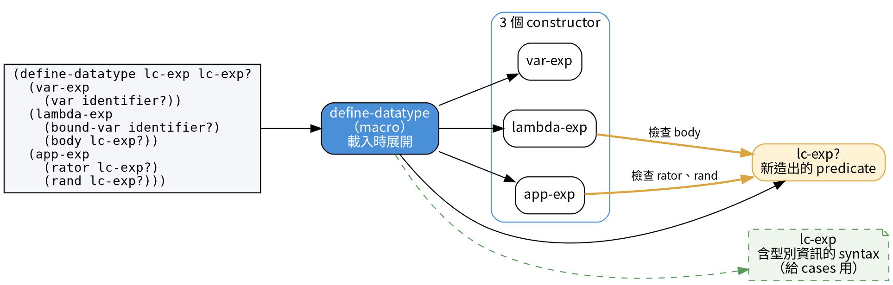

<!-- _class: lead -->

# 程式語言
## Programming Languages — Class 4

政大資碩 115-1　陳家宏

---

# 今天三堂課

| 堂 | 內容 |
|---|---|
| 第 1 堂 | §2.3 遞迴資料型別的介面、§2.4 前半：`define-datatype` 與 `cases`（pp.42–47） |
| 第 2 堂 | §2.4 後半、§2.5 abstract syntax 與 parse / unparse（pp.47–54） |
| 第 3 堂 | HW2 說明 ＋ 兩個隨堂演練：Ex 2.27、Ex 2.28 |

<br>

**HW1 今天截止**，請確認已上傳 Moodle。

---

# `(car (cadr exp))` 指的是什麼？

Ch1 的 `occurs-free?`（p.19）：

```racket
(define occurs-free?
  (lambda (var exp)
    (cond
      ((symbol? exp) (eqv? var exp))
      ((eqv? (car exp) 'lambda)
       (and
        (not (eqv? var (car (cadr exp))))
        (occurs-free? var (caddr exp))))
      (else
       (or
        (occurs-free? var (car exp))
        (occurs-free? var (cadr exp)))))))
```

拿 `exp = (lambda (x) (f x))` 來看：`(car (cadr exp))`、`(caddr exp)` 各取到什麼？
`else` 分支裡的 `(car exp)`、`(cadr exp)` 又是 lambda 運算式的哪一部分？

---

# 課本怎麼描述這個問題？

課本 p.19，寫完上一張的程式之後：

> 這個程序不太好讀。很難看出 `(car (cadr exp))` 指的是 lambda 運算式裡
> 變數的宣告，`(caddr exp)` 指的是它的 body。

課本 p.42，§2.3 開頭再提一次，並給出處理方式：
**替 lambda-calculus 運算式定義一個介面**。

<br>

p.42 用的文法就是 Ch1 的 Definition 1.1.8：

```
Lc-exp ::= Identifier
       ::= (lambda (Identifier) Lc-exp)
       ::= (Lc-exp Lc-exp)
```

---

# lc-exp 介面的三類成員

課本 pp.42–43：

```
;; constructors
var-exp                : Var → Lc-exp
lambda-exp             : Var × Lc-exp → Lc-exp
app-exp                : Lc-exp × Lc-exp → Lc-exp

;; predicates
var-exp?               : Lc-exp → Bool
lambda-exp?            : Lc-exp → Bool
app-exp?               : Lc-exp → Bool

;; extractors
var-exp->var           : Lc-exp → Var
lambda-exp->bound-var  : Lc-exp → Var
lambda-exp->body       : Lc-exp → Lc-exp
app-exp->rator         : Lc-exp → Lc-exp
app-exp->rand          : Lc-exp → Lc-exp
```

---

# `lambda-exp->body` 算 constructor 嗎？

課本 p.42：observer 分**兩種**——predicate 與 extractor。
上週判斷 stack 操作的作法：**看回傳型別**，回傳 stack 的算 constructor。

| 成員 | 回傳型別 | 課本歸類（p.42） |
|---|---|---|
| `lambda-exp` | Lc-exp | constructor |
| `lambda-exp?` | Bool | observer（predicate） |
| `lambda-exp->body` | **Lc-exp** | observer（extractor） |

用上週的作法，`lambda-exp->body` 會被歸成 constructor。
p.33 的定義：constructor「建造該型別的元素」，observer「從該型別的值中取出資訊」。

---

# 只依賴介面的 `occurs-free?`

課本 p.43：

```racket
(define occurs-free?
  (lambda (search-var exp)
    (cond
      ((var-exp? exp) (eqv? search-var (var-exp->var exp)))
      ((lambda-exp? exp)
       (and
        (not (eqv? search-var (lambda-exp->bound-var exp)))
        (occurs-free? search-var (lambda-exp->body exp))))
      (else
       (or
        (occurs-free? search-var (app-exp->rator exp))
        (occurs-free? search-var (app-exp->rand exp)))))))
```

課本 p.43：只要 lambda-calculus 運算式是用這些 constructor 造出來的，
不論採用哪一種表示法，這支程式都能用。

---

# 換一種表示法，哪一版要改？

Ex 2.16（p.43）的表示法：bound variable 外面**不加括號**，寫成 `(lambda x body)`。

| | Ch1 版（p.19） | 介面版（p.43） |
|---|---|---|
| `occurs-free?` 要改嗎？ | 要：`(car (cadr exp))` → `(cadr exp)` | 不用 |
| 介面實作要改什麼？ | （沒有介面） | `lambda-exp->bound-var` 一個 |

```racket
;; representation B: (lambda x body)
(define lambda-exp->bound-var (lambda (e) (cadr e)))   ; was (car (cadr e))

(occurs-free? 'x '(lambda y (x y)))   ; => #t
(occurs-free? 'x '(lambda x (x y)))   ; => #f
```

這就是上週 `plus` 換三種自然數表示法的同一個操作，換到遞迴資料型別上。

---

# Designing an interface for a recursive data type（p.43）

課本寫完介面版的 `occurs-free?` 之後，把設計這種介面的作法寫成一個通用的配方：

> **Designing an interface for a recursive data type**
> 1. 資料型別裡的每一種資料，各有一個 constructor。
> 2. 資料型別裡的每一種資料，各有一個 predicate。
> 3. 傳給 constructor 的每一塊資料，各有一個 extractor。

<br>

這是課本第六個加框命名的方法（前五個：Smaller-Subproblem Principle、
Proof by Structural Induction、Follow the Grammar、No Mysterious Auxiliaries、
The Interpreter Recipe）。

---

# The Interpreter Recipe 的第 2、3 步靠什麼？

上週的 The Interpreter Recipe（p.37）：

> **The Interpreter Recipe**
> 1. 看一筆資料。
> 2. 判斷它代表哪一種資料。
> 3. 取出這筆資料的各個組成部分，依它的種類做該做的處理。

<br>

第 2 步「判斷它代表哪一種資料」靠 predicate，
第 3 步「取出各個組成部分」靠 extractor。（我的解讀）

---

# 配方套在 lc-exp 上會數出幾個？

```
Lc-exp ::= Identifier                      ; 1 piece
       ::= (lambda (Identifier) Lc-exp)    ; 2 pieces
       ::= (Lc-exp Lc-exp)                 ; 2 pieces
```

| 規則 | 依據 | 數量 |
|---|---|---|
| 1. constructor | 3 種資料 | 3 |
| 2. predicate | 3 種資料 | 3 |
| 3. extractor | 1 + 2 + 2 塊資料 | 5 |
| 合計 | | 11 |

---

# API 還是 SPI？

（課外補充。以下是我整理的工作定義，EOPL 沒有用這兩個詞。）

**API**（Application Programming Interface）
由提供實作的一方定義，給外部程式使用的操作。

**SPI**（Service Provider Interface）
由框架定義、交給外部來寫實作的介面。實作寫好之後放進框架，
**何時被呼叫由框架決定**，實作者的程式碼只等著被呼叫。這個控制方向的反轉叫 **inversion of control**。

<br>

我們為 lc-exp 設計的介面（第 5 張的 11 個成員），是 API 還是 SPI？

在這個課本，是否存在一個 implicit framework？

---

# 介面要手寫多少？

課本 p.45，§2.4 的開場：資料型別一複雜，照配方手寫介面很快就變得繁瑣。

<br>

算一下：一個有 5 種資料、每種 3 個欄位的型別，要手寫
5 個 constructor ＋ 5 個 predicate ＋ 15 個 extractor ＝ **25 個程序**。

<br>

§2.4 介紹一個工具，自動產生並實作這種介面。
課本 p.45：這個工具產生的介面，和 §2.3 所介紹的介面**相似，但不全然相同**。

---

# `define-datatype lc-exp`

課本 p.46：

```racket
(define-datatype lc-exp lc-exp?
  (var-exp
   (var identifier?))
  (lambda-exp
   (bound-var identifier?)
   (body lc-exp?))
  (app-exp
   (rator lc-exp?)
   (rand lc-exp?)))
```

```
Lc-exp ::= Identifier
       ::= (lambda (Identifier) Lc-exp)
       ::= (Lc-exp Lc-exp)
```

名稱縮寫（p.46）：`var` variable、`bound-var` bound variable、
`app-exp` application expression、`rator` operator、`rand` operand。

---

# 這個宣告產生了哪些東西？

課本 p.46：三個 constructor `var-exp`、`lambda-exp`、`app-exp`，以及一個 predicate `lc-exp?`。
constructor 會用欄位的 predicate 檢查引數。

```racket
(define identifier? symbol?)   ; the book does not define this; add it yourself

(var-exp 'x)          ; => #(struct:var-exp x)
(lc-exp? (var-exp 'x)) ; => #t
(lc-exp? 'x)          ; => #f
(var-exp 5)           ; var-exp: bad value for var field: 5
```

課本 p.46：只用這些 constructor 造出來的 lc-exp，它和它的每個子運算式都合法，
處理時可以省掉很多檢查。

（`identifier?` 的定義，Ex 2.23 會要你改得更精確。）

---

# 圖解：`define-datatype` 展開成什麼？



macro 的依據：課本致謝（p.xxii）稱它為 syntactic extension；`#lang eopl` 用 `define-syntax` 定義它。

橘色箭頭：constructor 檢查欄位時，呼叫同一個宣告剛造出的 `lc-exp?`。

綠色虛線：`lc-exp` 這個名字綁成一個 syntax，存著型別資訊給 `cases` 用；直接求值會得到 `illegal use of syntax`。

---

# 「相似，但不全然相同」差在哪？

| 成員 | §2.3 手寫（pp.42–43） | §2.4 `define-datatype`（p.46） |
|---|---|---|
| constructor | `var-exp`、`lambda-exp`、`app-exp` | 同名，另外會檢查引數 |
| predicate | 每種資料一個：`var-exp?` … | 每個型別一個：`lc-exp?` |
| extractor | 5 個 | 沒有 |

<br>

§2.3 的 11 個成員，有 8 個在右欄找不到。
課本 p.46：§2.3 的 predicate 與 extractor 的工作由 `cases` 接手——判斷值屬於哪一個 variant，並取出它的欄位。

---

# `cases` 版的 `occurs-free?`

課本 p.46：

```racket
(define occurs-free?
  (lambda (search-var exp)
    (cases lc-exp exp
      (var-exp (var) (eqv? var search-var))
      (lambda-exp (bound-var body)
        (and (not (eqv? search-var bound-var))
             (occurs-free? search-var body)))
      (app-exp (rator rand)
        (or (occurs-free? search-var rator)
            (occurs-free? search-var rand))))))
```

---

# `cases` 的 `app-exp` 子句做了什麼？

課本 p.47：當 `exp` 是 `app-exp` 造的，`app-exp` 子句被選中，
`rator`、`rand` 綁到兩個子運算式，效果等同於

```racket
(if (app-exp? exp)
    (let ((rator (app-exp->rator exp))
          (rand  (app-exp->rand exp)))
      (or (occurs-free? search-var rator)
          (occurs-free? search-var rand)))
    ...)
```

---

# 第 1 堂回顧

1. Ch1 的 `occurs-free?` 用 `c*r` 取資料，課本說它不好讀（p.19、p.42）
2. 遞迴資料型別的介面：constructors，加上兩種 observers——predicates 與 extractors（p.42）
3. **Designing an interface for a recursive data type**：每種資料一個 constructor、一個 predicate；每塊資料一個 extractor（p.43）
4. `define-datatype` 自動產生 constructors 與一個型別 predicate，constructor 會檢查引數（p.46）
5. predicates 與 extractors 的工作，改由 `cases` 承擔（p.46）

---

<!-- _class: lead -->

# 第 2 堂
## §2.4 後半、§2.5 abstract syntax

---

# `define-datatype` 的一般形式有哪些限制？

```
;; general form (p.47)
(define-datatype type-name type-predicate-name
  {(variant-name {(field-name predicate)}*)}+)
```

課本 p.47 的限制：兩個型別不能同名；兩個 variant 不能同名，**即使屬於不同型別**；
型別名稱不能拿來當 variant 名稱；欄位的 predicate 必須是 Scheme predicate。

為什麼不同型別的 variant 也不能同名？到 REPL 試：

```racket
(define-datatype t1 t1? (foo (x number?)))
(define-datatype t2 t2? (foo (y symbol?)))
;; module: identifier already defined
;;   at: foo
;;   in: (define-values (t2? foo foo? foo-accessor) ...
```

我的解讀：variant 名稱會變成 constructor 的程序名稱（見錯誤訊息的 `define-values`），兩個型別共用同一個命名空間。

---

# S-list 用 `define-datatype` 怎麼寫？

課本 p.48，Ch1 的 S-list 文法 `S-list ::= ({S-exp}*)`、`S-exp ::= Symbol | S-list`：

```racket
(define-datatype s-list s-list?
  (empty-s-list)
  (non-empty-s-list (first s-exp?) (rest s-list?)))

(define-datatype s-exp s-exp?
  (symbol-s-exp (sym symbol?))
  (s-list-s-exp (slst s-list?)))
```

課本把 `({S-exp}*)` 拆成兩種資料：空的、非空的。兩個型別互相引用。

| 命名慣例（p.48） | 例子 |
|---|---|
| 只有一個 variant（等於一個 record） | `a-type-name` 或 `an-type-name` |
| 多個 variant | `variant-name-type-name` |

---

# sum type 與 variant 是什麼關係？

（課外補充。課本沒有用 sum type 這個詞。）

**sum type**：一個值必定是幾個 variant 之中的某一個。

`lc-exp` ＝ `var-exp` ＋ `lambda-exp` ＋ `app-exp`

每一個 variant 各有一個 constructor，就是圖解頁那 3 個。

---

# 兩個 variant 裝同一種東西，分得出來嗎？

```racket
(define-datatype shape shape?
  (circle (r number?))
  (square (side number?)))

(define area
  (lambda (s)
    (cases shape s
      (circle (r) (* 3 r r))
      (square (side) (* side side)))))

(equal? (circle 2) (square 2))   ; => ?
(area (circle 2))                ; => ?
(area (square 2))                ; => ?
```

兩個 variant 裡裝的都是數字 2。`cases` 靠什麼決定走哪一個子句？

---

# `(list-of pred)` 回傳什麼？

S-list 的另一種寫法（p.48）：直接用 Scheme list 裝 s-exp。

```racket
(define-datatype s-list s-list?
  (an-s-list
   (sexps (list-of s-exp?))))

(define list-of
  (lambda (pred)
    (lambda (val)
      (or (null? val)
          (and (pair? val)
               (pred (car val))
               ((list-of pred) (cdr val)))))))
```

```racket
((list-of symbol?) '(a b c))   ; => ?
((list-of symbol?) '(a b 3))   ; => ?
(list-of symbol?)              ; => ?
;; #lang eopl already provides list-of
```

---

# `cases` 什麼時候需要 else？

```
;; general form (p.49)
(cases type-name expression
  {(variant-name ({field-name}*) consequent)}*
  (else default))
```

課本 p.49：else 子句可有可無。**沒有 else 時，每個 variant 都必須有一個子句。**

```racket
;; occurs-free? from p.46, with the lambda-exp clause deleted
(define occurs-free?
  (lambda (search-var exp)
    (cases lc-exp exp
      (var-exp (var) (eqv? var search-var))
      (app-exp (rator rand)
        (or (occurs-free? search-var rator)
            (occurs-free? search-var rand))))))
;; no line calls occurs-free?, yet loading the file fails:
;; cases: missing cases for the following variants: lambda-exp
```

**為什麼要在意：**（我的補充）新增 variant 後，漏寫它的 `cases` 載入就報錯。

---

# 欄位名稱怎麼對應？

課本 p.49：`cases` 依**位置**綁定變數——第 i 個變數，綁到第 i 個欄位的值。

所以課本說，我們也可以寫成

```racket
(app-exp (exp1 exp2)
  (or
   (occurs-free? search-var exp1)
   (occurs-free? search-var exp2)))
```

來取代

```racket
(app-exp (rator rand)
  (or
   (occurs-free? search-var rator)
   (occurs-free? search-var rand)))
```

---

# `define-datatype` 的代價是什麼？

課本 p.49：`define-datatype` 與 `cases` 提供定義歸納資料型別的一種方便作法，課本也提醒還有其他作法。
有時候為了更精簡或更有效率，會採用專用的表示法；代價是介面裡的程序要自己手寫。

<br>

**為什麼要在意：** 我的解讀——這又是 §2.1 的介面與表示法之分。
`define-datatype` 替你選了一種表示法；想換，就回到 §2.3 手寫介面。

---

# DSL 是什麼？

課本 pp.49–50：`define-datatype` 是 domain-specific language 的一個例子——
一個小語言，用來描述一小組定義明確的任務之中的一個任務；這裡的任務是定義遞迴資料型別。

DSL 可以住在通用語言裡面（如 `define-datatype`），也可以是自帶工具的獨立語言。

<br>

建構 DSL 的一般作法：先找出這組任務之中**可能會變化的部分**，再設計一個語言來描述這些變化。
課本說，這通常是很有用的策略。（課本 p.50）

套在 `define-datatype` 上，會變化的部分有三處：有哪些 variant、每個 variant 有哪些欄位、每個欄位用什麼 predicate。（我的解讀）

---

# 同一組 lambda 運算式，兩種寫法

課本 p.51：文法通常指定了一種表示法——用文法產生的字串或值來表示資料。
這種表示法叫 **concrete syntax**，也叫 **external representation**。

```
;; Definition 1.1.8
Lc-exp ::= Identifier
       ::= (lambda (Identifier) Lc-exp)
       ::= (Lc-exp Lc-exp)

;; another concrete syntax (p.51)
Lc-exp ::= Identifier
       ::= proc Identifier => Lc-exp
       ::= Lc-exp(Lc-exp)
```

| 第一種 | 第二種 |
|---|---|
| `(lambda (x) (f (f x)))` | `proc x => f(f(x))` |

---

# abstract syntax（p.51）

> In order to process such data, we need to convert it to an internal representation.
> The define-datatype form provides a convenient way of defining such an internal
> representation. We call this abstract syntax.

要處理這些資料，得先把它轉成**內部表示法**。`define-datatype` 提供了定義這種內部表示法的方便作法。
這種內部表示法，稱為 **abstract syntax**。

```racket
'x                      ; concrete syntax
(var-exp 'x)            ; => #(struct:var-exp x)   abstract syntax
(lc-exp? 'x)            ; => #f
(lc-exp? (var-exp 'x))  ; => #t
```

---

# 哪些 token 需要存進 abstract syntax？

課本 p.51：括號之類的 terminal 不必儲存，它們不帶資訊；
內部表示法必須能判斷這是哪一種運算式，並取出它的組成部分。

以 `(lambda (x) (f (f x)))` 為例，parse 的結果（p.53 的 `parse-expression`）：

```racket
#(struct:lambda-exp x
  #(struct:app-exp #(struct:var-exp f)
    #(struct:app-exp #(struct:var-exp f) #(struct:var-exp x))))
```

| concrete syntax 的 token | 在 abstract syntax 裡 |
|---|---|
| `(`、`)` | 不存。巢狀關係由樹的形狀表示（我的解讀） |
| `lambda` | 不存成欄位。由 variant 名稱 `lambda-exp` 表示 |
| 參數 `x` | 存進 `lambda-exp` 的 `bound-var` 欄位 |
| `f`、`f`、`x` | 各存進一個 `var-exp` 的 `var` 欄位 |
| （application 沒有關鍵字） | 由 variant 名稱 `app-exp` 表示 |

---

# `(lambda (x) (f (f x)))` 的 abstract syntax tree

Figure 2.2（p.52，重繪）：

```
lambda-exp
├── bound-var : x
└── body      : app-exp
                ├── rator : var-exp ── var : f
                └── rand  : app-exp
                            ├── rator : var-exp ── var : f
                            └── rand  : var-exp ── var : x
```

讀法：`節點` 是 production 名稱；`欄位 :` 是邊的標籤；最右邊的 `f`、`x` 是葉子。

課本 p.51：內部節點標的是 production 名稱；邊標的是對應那一處 nonterminal 的名稱（如 `body`、`rator`）；葉子對應 terminal 字串。

---

# 一套記號同時寫出 concrete 與 abstract

課本 p.52：要替一套 concrete syntax 建立 abstract syntax，得替每個 production、
以及每個 production 裡每一處 nonterminal 取名字。
每個 nonterminal 一個 `define-datatype`，每個 production 一個 variant。

```
Lc-exp ::= Identifier
           var-exp (var)
       ::= (lambda (Identifier) Lc-exp)
           lambda-exp (bound-var body)
       ::= (Lc-exp Lc-exp)
           app-exp (rator rand)
```

| 這一行寫的是 | 給誰用（p.52） |
|---|---|
| `::=` 右邊 | concrete syntax，主要給人看 |
| 下一行的名字 | abstract syntax，主要給電腦用 |

---
# 字串與 list，parse 難度差在哪？

課本 p.53：

| concrete syntax 是… | 轉成 AST 的工作 |
|---|---|
| 字元組成的字串 | 可能很複雜。這件事叫 **parsing**，由 **parser** 執行。通常交給 **parser generator**：輸入文法，產生 parser。文法本身要用一個描述文法的 DSL 來寫 |
| list 組成的集合 | 簡單很多。Scheme 的 `read` 已經把字串轉成 list 與 symbol，剩下的是把 list 轉成 AST |

<br>

在 REPL 打 `'(lambda (x) (f (f x)))`，reader 已經完成了第一步：

```racket
(define d '(lambda (x) (f (f x))))
(car d)             ; => lambda
(symbol? (car d))   ; => #t
(cadr d)            ; => (x)
```

---

# `parse-expression`

課本 p.53：

```racket
(define parse-expression
  (lambda (datum)
    (cond
      ((symbol? datum) (var-exp datum))
      ((pair? datum)
       (if (eqv? (car datum) 'lambda)
           (lambda-exp
            (car (cadr datum))
            (parse-expression (caddr datum)))
           (app-exp
            (parse-expression (car datum))
            (parse-expression (cadr datum)))))
      (else (report-invalid-concrete-syntax datum)))))
```

```racket
(parse-expression '(lambda (x) (f (f x))))
;; => #(struct:lambda-exp x
;;      #(struct:app-exp #(struct:var-exp f)
;;        #(struct:app-exp #(struct:var-exp f) #(struct:var-exp x))))
```

---

# `(car (cadr datum))` 又出現了？

第 1 堂開頭那支 Ch1 的 `occurs-free?`，裡面有 `(car (cadr exp))`。
上一張的 `parse-expression`，裡面有 `(car (cadr datum))`。

我的解讀：知道「concrete syntax 長什麼樣」的程式碼，現在集中到 parser 這一處；
`cases` 版的 `occurs-free?` 只看 AST。
上週時間的故事也是這個動作——把 parse 移到邊界。

concrete syntax 若換成 Ex 2.16 的 `(lambda x body)`：

| 程式 | 要改嗎 | 改哪裡 |
|---|---|---|
| `parse-expression` | 要 | `(car (cadr datum))` → `(cadr datum)` |
| 下一張的 `unparse-lc-exp` | 要 | `(list bound-var)` → `bound-var` |
| `cases` 版的 `occurs-free?`（p.46） | 不用 | 它只看 AST |

---

# `unparse-lc-exp`

```racket
;; pp.53-54
(define unparse-lc-exp
  (lambda (exp)
    (cases lc-exp exp
      (var-exp (var) var)
      (lambda-exp (bound-var body)
        (list 'lambda (list bound-var) (unparse-lc-exp body)))
      (app-exp (rator rand)
        (list (unparse-lc-exp rator) (unparse-lc-exp rand))))))
```

```racket
(unparse-lc-exp (parse-expression '(lambda (x) (f (f x)))))  ; => (lambda (x) (f (f x)))
(unparse-lc-exp (parse-expression '(lambda (x y) x)))        ; => (lambda (x) x)
(unparse-lc-exp (parse-expression '(a b c)))                 ; => (a b)
```

後兩行轉回來跟原本不一樣：多出來的 `y`、`c` 在 parse 時被丟掉。Ex 2.30（p.54）稱這個 parser 為 fragile。

**為什麼要在意：**（我的補充）除錯時印出可讀形式；parse 再 unparse 可當測試。

---

# 第 2 堂回顧

1. `define-datatype` 的一般形式；variant 名稱即使跨型別也不能重複（p.47）
2. `list-of` 由一個 predicate 造出另一個 predicate（p.48）
3. `cases` 沒有 else 時要涵蓋每個 variant；欄位依位置綁定（p.49）
4. `define-datatype` 是 DSL；代價是值一律存成它產生的 struct，想換存法就得手寫介面（p.49）
5. concrete syntax 給人看，abstract syntax 給電腦用（pp.51–52）
6. parse：concrete → AST；unparse：AST → concrete（p.53）

---

<!-- _class: lead -->

# 第 3 堂
## HW2 ＋ 課堂演練

---

# HW2：六個題號

| 題號 | 內容 | 難度 | 頁碼 |
|---|---|---|---|
| 2.10 | `extend-env*`（a-list 表示法） | ★ | p.39 |
| 2.12 | stack，程序表示法 | ★ | p.42 |
| 2.17 | lc-exp 的另外兩種表示法 | ★ | p.44 |
| 2.22 | stack，`define-datatype` | ★ | p.50 |
| 2.26 | red-blue tree | ★★ | p.51 |
| 2.29 | Kleene star 的 abstract syntax 與 parser | ★ | p.54 |

**繳交期限：week 6 上課前，上傳 Moodle。**

---

# 每題練到什麼

| 題號 | 如果你答得出來，代表你會了 |
|---|---|
| 2.10 | 在上週演練的 a-list 表示法上，照題目給的等式加一個 constructor |
| 2.12 | stack 的 observer 不只一個；p.40 說 environment 恰好只有一個 observer，stack 沒有這個性質 |
| 2.17 | 自己設計表示法；p.43 的 `occurs-free?` 一個字都不改，兩種表示法都要能跑 |
| 2.22 | 同一份 stack 規格，交給 `define-datatype` 產生表示法 |
| 2.26 | HW1 的 1.33 用 `define-datatype` 重寫；`blue-node` 的 Kleene star |
| 2.29 | Kleene star 在 abstract syntax 裡用 `list-of` 表示 |

---

# 2.12、2.22 與上週的 2.4

2.12 與 2.22 實作的，是上週演練一寫出的 stack 規格。

兩個實作跑同一組 client 測試，結果要一樣：

```racket
(define s (push 3 (push 2 (push 1 (empty-stack)))))

(list (top s)
      (top (pop s))
      (empty-stack? s)
      (empty-stack? (pop (pop (pop s)))))
;; 2.12 procedural       => (3 2 #f #t)
;; 2.22 define-datatype  => (3 2 #f #t)
```

每一行測試，都是上週那幾條等式的一個具體例子。
自己再補兩行，測 `push` 之後 `pop` 回到原來的 stack。

---

# 硬性要求

**一、每個函式都要有 contract 與 usage 註解。**（同 HW1）

**二、每個輔助函式要有自己的獨立規格。**（同 HW1）

**三、自己補測試。** 每題至少兩個課本沒給的例子，包含邊界情況。（同 HW1）

**四、每個 `define-datatype` 上方，用 p.52 的記號寫出它對應的文法。**

```racket
;; Red-blue-subtree ::= (red-node Red-blue-subtree Red-blue-subtree)
;;                      red-node (left right)
;;                  ::= ...
(define-datatype red-blue-subtree red-blue-subtree?
  ...)
```

**五、2.17 的兩種表示法，都要跑 p.43 的 `occurs-free?`，並附上結果。**

---

# 常見錯誤清單

| 錯誤 | 症狀 |
|---|---|
| `cases` 裡順手寫了 else | 漏寫的 variant 不會被報出來，悄悄走 else |
| 欄位 predicate 寫成 `list-of`，少了 `(list-of pred)` | 任何值都通過檢查：`(blue-node 5)` 不會報錯 |
| 兩個型別裡有同名的 variant | `module: identifier already defined` |
| 沒有定義 `identifier?` | `identifier?: unbound identifier` |
| 2.17 的 client 直接用 `car`／`cadr` | 換到第二種表示法就出錯 |

---

<!-- _class: lead -->

# 課堂演練
## 兩題，現場做

---

# 演練一：Exercise 2.27 ★（p.54）

> 畫出下面兩個 lambda-calculus 運算式的 abstract syntax tree。

```racket
((lambda (a) (a b)) c)

(lambda (x)
  (lambda (y)
    ((lambda (x)
       (x y))
     x)))
```

照 Figure 2.2（p.52）的畫法：節點標 production 名稱，邊標欄位名稱，葉子是 symbol。
第二個運算式有兩個 `(lambda (x) ...)`：指出每個 `x` 的葉子掛在哪一個 `lambda-exp` 底下。

**分組討論 8 分鐘**，之後抽一組上台畫。

---

# 演練一：用 `parse-expression` 對答案

```racket
(parse-expression '((lambda (a) (a b)) c))
;; #(struct:app-exp
;;   #(struct:lambda-exp a
;;     #(struct:app-exp #(struct:var-exp a) #(struct:var-exp b)))
;;   #(struct:var-exp c))

(parse-expression '(lambda (x) (lambda (y) ((lambda (x) (x y)) x))))
;; #(struct:lambda-exp x
;;   #(struct:lambda-exp y
;;     #(struct:app-exp
;;       #(struct:lambda-exp x
;;         #(struct:app-exp #(struct:var-exp x) #(struct:var-exp y)))
;;       #(struct:var-exp x))))
```

---

# 演練二：Exercise 2.28 ★（p.54）

> 寫一個 unparser，把 lc-exp 的 abstract syntax 轉成一個**字串**，
> 符合本節的第二套文法。

第二套文法（p.51；題目原文寫 page 52）：

```
Lc-exp ::= Identifier
       ::= proc Identifier => Lc-exp
       ::= Lc-exp(Lc-exp)
```

```racket
(unparse->string (parse-expression '(lambda (x) (f (f x)))))
;; => "proc x => f(f(x))"
```

會用到的 Scheme 程序：`symbol->string`、`string-append`。

**分組討論 10 分鐘**，之後抽一組上台，跑下一張的測試。

---

# 演練二：骨架

```racket
;; unparse->string : LcExp -> String
;; usage: (unparse->string exp) returns exp written in the
;;        proc / => concrete syntax of section 2.5.
(define unparse->string
  (lambda (exp)
    (cases lc-exp exp
      (var-exp (var)
        ???)
      (lambda-exp (bound-var body)
        ???)
      (app-exp (rator rand)
        ???))))
```

---

# 演練二：兩棵樹，同一個字串？

把課本的 `unparse-lc-exp` 和你的 `unparse->string` 並排跑：

```racket
;; tree A
(parse-expression '((lambda (a) (a b)) c))
;;   unparse-lc-exp  => ((lambda (a) (a b)) c)
;;   unparse->string => "proc a => a(b)(c)"

;; tree B
(parse-expression '(lambda (a) ((a b) c)))
;;   unparse-lc-exp  => (lambda (a) ((a b) c))
;;   unparse->string => "proc a => a(b)(c)"
```

兩棵不同的 AST，轉成第二套 concrete syntax 之後是同一個字串。

- 拿到 `"proc a => a(b)(c)"` 的人，能還原出原本是哪一棵樹嗎？
- 第一套文法為什麼沒有這個問題？
- 要讓第二套文法分得出來，你會在 unparser 裡加什麼？

---

# 下週預告

**week 5：§3.1–3.2，LET 語言**

**本週請完成：**

- [ ] HW2 開始動手（week 6 上課前交）
- [ ] §2.3–2.5 讀過一遍，今天兩個演練確定自己會寫

---

# 本日結論

> 遞迴資料型別的介面：constructors、predicates、extractors。
> `define-datatype` 替你產生 constructors；§2.3 的 predicates、extractors 的工作交給 `cases`。
> `define-datatype` 提供了定義 internal representation 的方便作法，這種表示法稱為 **abstract syntax**（p.51）。
> concrete syntax 經過 parse 變成 abstract syntax，程式的其他部分只看 abstract syntax。

<br>

今天驗證過的：`occurs-free?` 換表示法不必改；`cases` 漏寫 variant，檔案載入時就報錯；
同一棵 AST 可以 unparse 成兩種 concrete syntax。

---

<!-- _class: lead -->

# 問題時間

1. Email: laurence@replware.dev
2. Office Hour: 週四下午 1:00~2:00，請先跟我約
3. 助教：邵振皓 (負責改作業、監考)
4. 助教信箱：114971020@nccu.edu.tw
5. 作業一律上傳 Moodle
