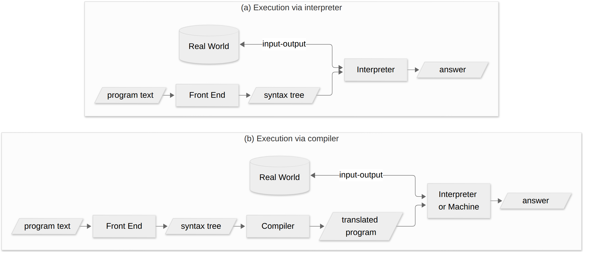
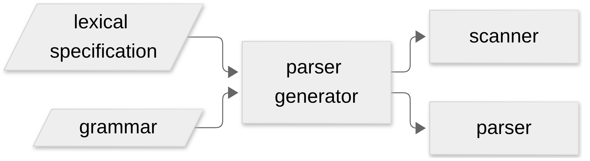
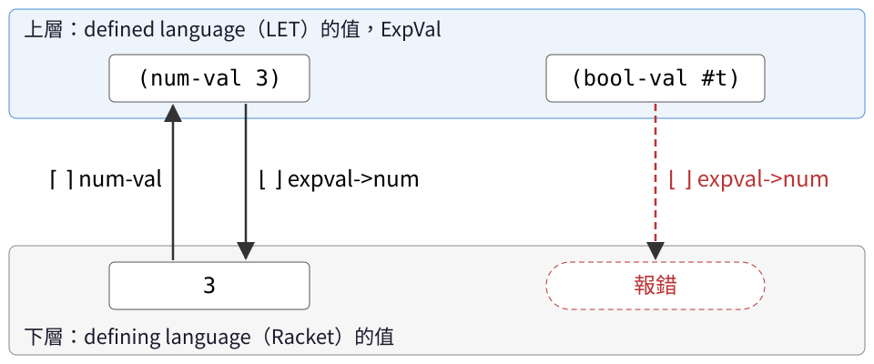

<!-- _class: lead -->

# 程式語言
## Programming Languages — Class 5

政大資碩 115-1　陳家宏

---

# 今天三堂課

| 時段 | 內容 |
|---|---|
| 第 1 堂 | §3.1 前端：scanning 與 parsing（pp.57–59）；parse 與 validate |
| 第 2 堂 | §3.2 LET 的規格與實作（pp.60–72） |
| 第 3 堂 | Fennel 的 jump-to-def：tree-sitter 與直譯器；兩個隨堂演練 |

---


# 上週停在哪裡？

```
;; 上週（§2.5）
read             : String    → SchemeVal   ; p.53 的描述：Scheme 內建的 read，把字串轉成 list 與 symbol
parse-expression : SchemeVal → LcExp       ; p.53

;; 本週（§3.2）
scan&parse       : String    → Program     ; 由 p.71 推出，課本沒寫這個簽名
value-of-program : Program   → ExpVal      ; p.71
run              : String    → ExpVal      ; p.71
```

---

# 兩個前端，相同與不同在哪？

| | 上週 | 本週 |
|---|---|---|
| 前端由誰組成 | `read`，再 `parse-expression` | `scan&parse` 一步完成 |
| 前端的輸出 | `LcExp` | `Program` |
| 和 LcExp 對應的型別 | — | `Expression`；`Program` 在外面多包一層 `a-program`（p.60, p.69） |

兩個「前端」的輸出都是 **AST**，型別由 `define-datatype` 定義（p.52、p.69）。
Program 的值也是 Scheme 值（p.15 的 SchemeVal），簽名寫 Program，是因為它帶的資訊比較多。

---

# 第三章開頭說了什麼？

課本 p.57（我的中譯）：

> 這一章研究變數的 binding 與 scoping。做法是依序介紹一系列小語言，
> 為它們寫規格，再用直譯器實作。規格與直譯器都多帶一個 context 參數，
> 叫做 environment，用來記錄每個變數在當下的意義。

---


# `(value-of exp ρ) = val` 怎麼讀？

課本 p.57：第三章的規格由這種形式的斷言組成，意思是「exp 在環境 ρ 裡的值應該是 val」。

| 符號 | 意思 | 定義在哪 |
|---|---|---|
| `exp` | 一個 expression 的 AST | Figure 3.2（p.60）、Figure 3.6（p.69） |
| `ρ` | environment | §2.2（p.36）；記號在 p.61 |
| `val` | expressed value | p.61 |

課本 p.57：先寫推論規則與等式，用手推出這種斷言；接著才寫程式實作。

**為什麼要在意**（我的補充）：寫程式之前，就能先用手算出「這個程式應該得到什麼」。
程式算出別的答案時，手上有一個可以對照的標準。

---

# Figure 3.1：兩條執行路線（p.59）



<!-- 圖的原始碼：img/fig3-1.mmd（Mermaid），設定檔 img/config.json。 -->

p.58：target language 常是機器語言；也可以是一個較簡單、容易寫直譯器的語言。
後者因歷史因素稱為 **byte code**，它的直譯器稱為 **virtual machine**。

這門課走 (a)。

---

# 在這門課裡，誰是 defined language？

| 課本用語（p.57） | 意思 | 這門課 |
|---|---|---|
| source language／defined language | 被實作的語言 | LET（本週） |
| implementation language／defining language | 用來寫直譯器的語言 | Racket（`#lang eopl`） |

<br>

```racket
(let ((val1 (value-of exp1 env)))          ; p.72, Figure 3.9
  (value-of body (extend-env var val1 env)))
```

```
let x = 5 in -(x,3)                        ; p.66
```

問題：上面兩段都有 `let`。各屬於表格的哪一列？

---

# 前端分哪兩步？（p.58）

```
"let x = 5 in -(x,3)"
        │  scanning  ← lexical specification
        ▼
 let  x  =  5  in  -  (  x  ,  3  )            ← tokens
        │  parsing   ← grammar
        ▼
#(struct:a-program
  #(struct:let-exp x #(struct:const-exp 5)
    #(struct:diff-exp #(struct:var-exp x) #(struct:const-exp 3))))
```

| 步驟 | 輸入 → 輸出 | 依據 |
|---|---|---|
| scanning | 字元序列 → token 序列 | lexical specification |
| parsing | token 序列 → AST | grammar |

---


# scanner 實際做了什麼？

Figure B.1（p.380）的輸入：

```
foo bar %here is a comment
) begin baz
```

| 字元 | scanner 的處理 |
|---|---|
| `foo`、`bar`、`baz` | identifier |
| 空白、換行 | 忽略 |
| `%here is a comment` | 註解，忽略 |
| `)` | 標點 |
| `begin` | keyword，要和 identifier 區分開 |

pp.381–382：每個 token 至少帶三樣資料——類別、內容、**在輸入中的位置**。
位置可以讓 parser 指出語法錯誤在哪裡。第 3 堂會回到「位置」。

---


# parser generator 吃什麼、吐什麼？

p.58：



<!-- 圖的原始碼：img/parser-generator.mmd（Mermaid），設定檔 img/config.json。 -->

p.67：LET 的實作用 **SLLGEN** 當前端（Appendix B, p.379 起）。

**為什麼要在意**：從這一章起，正文的 parser 由 SLLGEN 產生，程式碼不再列在課本裡。

---

# 不用 parser generator 的話呢？

p.59 提到另外兩條路：

1. 手寫 scanner 與 parser（細節見 compiler 教科書）
2. 忽略 concrete syntax 的細節，直接把 concrete syntax 寫成 **list 結構**，也就是 §2.5 的 `parse-expression` 的輸入的形式。

要看手寫 parser 的長相，§2.5 的 `parse-expression` 是現成的例子。

---

# "Parse, don't validate" 是什麼意思？

出處：Alexis King，2019 年的部落格文章 *Parse, don't validate*（課本外）。

我的轉述：檢查輸入時，把結果轉成一個新型別的值交出去。
之後的程式只收這個型別，就不必再檢查一次。

```racket
parse-expression : SchemeVal → LcExp           ; p.53
occurs-free?     : Sym × LcExp → Bool          ; p.46, written with cases
```

套到 §2.5（我的解讀）：

- `parse-expression` 的輸入可以是任何 Scheme 值；只要有回傳，回傳的就是 `lc-exp`
- `occurs-free?` 收的是 `lc-exp`，用 `cases` 直接取欄位，不必再檢查原始 list 的形狀

---

# `(a b c)` 交給 `parse-expression` 會怎樣？

```racket
> (parse-expression '(a b c))
#(struct:app-exp #(struct:var-exp a) #(struct:var-exp b))
```

Ex 2.30 [★★]（p.54）：課本說這個 `parse-expression` 是 **fragile**——
偵測不到 `(a b c)` 這類錯誤，遇到 `(lambda)` 則以不恰當的錯誤訊息中止。

我的解讀：把 parse 放在邊界，前提是 parser 會拒絕不合法的輸入。

---

# 第 1 堂回顧

1. 第三章的策略：先替每個語言寫規格，再照 interpreter recipe 用直譯器實作（p.57）
2. 規格的形式：`(value-of exp ρ) = val`（p.57）
3. defined language 與 defining language（p.57）；直譯器與編譯器兩條路（Figure 3.1, p.59）
4. 前端 = scanning + parsing；token 帶有位置資料（p.58；pp.381–382）
5. 第三章起，LET 的前端由 SLLGEN 產生（p.67）
6. parse 之後資料已是 `lc-exp`，下游不必再檢查（p.53；p.46）。parser 要拒絕不合法的輸入，才擋得住錯誤（Ex 2.30, p.54）

---

<!-- _class: lead -->

# 第 2 堂
## §3.2 LET：規格與實作（pp.60–72）

---

# §3.2 的地圖

以下兩條邏輯的整理是我的解讀。

**規則的形式**：每條規則都在定義這個函數（p.62）

```
value-of : Exp × Env → ExpVal
```

| 型別 | 意思 | 小節 |
|---|---|---|
| Exp | 程式長什麼樣 | 3.2.1（p.60） |
| ExpVal | 結果可以是什麼 | 3.2.2（p.61） |
| Env | 變數代表什麼 | 3.2.3（p.61） |

---

# §3.2 的地圖（續）

**小節的順序**：語言一次長一個功能

| 順序 | 內容 | 小節 |
|---|---|---|
| 1 | 數字與變數：const、var、diff | 3.2.4（p.62） |
| — | 整個程式的初始環境 | 3.2.5（p.63） |
| 2 | 布林：zero?、if | 3.2.6（p.63） |
| 3 | let | 3.2.7（p.65） |
| 4 | 把規則寫成程式 | 3.2.8（p.67） |

3.2.5 夾在數字和布林之間：先定好初始環境 [i=⌈1⌉, v=⌈5⌉, x=⌈10⌉]，
Figure 3.3（p.64）才能用它算第一個例子。

---

# Figure 3.2：LET 有幾種 expression？（p.60）

```
Program    ::= Expression
               a-program (exp1)
Expression ::= Number
               const-exp (num)
Expression ::= -(Expression , Expression)
               diff-exp (exp1 exp2)
Expression ::= zero? (Expression)
               zero?-exp (exp1)
Expression ::= if Expression then Expression else Expression
               if-exp (exp1 exp2 exp3)
Expression ::= Identifier
               var-exp (var)
Expression ::= let Identifier = Expression in Expression
               let-exp (var exp1 body)
```

記號與 p.52 相同：`::=` 那一行是 concrete syntax，下一行是 abstract syntax（variant 名稱與欄位名稱）。

---

# 這個語言的值有哪些？

課本 p.61：

```
ExpVal = Int + Bool
DenVal = Int + Bool
```

| 名稱 | p.61 的定義 |
|---|---|
| expressed values | expression 可能算出的值 |
| denoted values | 變數可能綁定到的值 |

p.61：這一章的語言裡，兩者都相同。

**為什麼要在意**：Ex 3.13 [★]（p.73）要你把值改成只有整數、0 當 false。
值的集合是 defined language 的設計決定，可以和 Racket 不一樣。

---

# ExpVal 的介面（p.61）

```
num-val      : Int    → ExpVal
bool-val     : Bool   → ExpVal
expval->num  : ExpVal → Int
expval->bool : ExpVal → Bool
```

p.61：參數不是數字時，`expval->num` 是 undefined；
參數不是布林時，`expval->bool` 是 undefined。
實作選擇報錯（p.67；Figure 3.7, p.70）。

`num-val`、`bool-val` 是 constructor；`expval->num`、`expval->bool` 課本稱為 **extractor**（p.67）。

---

# ⌈⌊val⌋⌉ 一定等於 val 嗎？

課本 p.63 的縮寫：

| 記號 | 代表 |
|---|---|
| «exp» | expression exp 的 AST |
| ⌈n⌉ | `(num-val n)` |
| ⌊val⌋ | `(expval->num val)` |

p.63 說推導中會用到 ⌊⌈n⌉⌋ = n。

<br>

- Ex 3.1 [★]（p.63）：在 Figure 3.3 裡，列出每一個用到 ⌊⌈n⌉⌋ = n 的地方。
- Ex 3.2 [★★]（p.63）：找一個 val ∈ ExpVal，使得 ⌈⌊val⌋⌉ ≠ val。

<!-- 答案方向：val = (bool-val #t)；⌊val⌋ 沒有定義（實作會報錯）。 -->

---

# ⌈ ⌉ 和 ⌊ ⌋ 怎麼記？



這張圖是我的記憶法，課本沒有「上下層」的說法。
⌈n⌉ 把下層的值送上去；⌊val⌋ 把上層的值拿下來（p.63）。

---

# 用這張圖讀 diff 的等式

```
(value-of (diff-exp exp1 exp2) ρ)
  = ⌈(- ⌊(value-of exp1 ρ)⌋ ⌊(value-of exp2 ρ)⌋)⌉        ; p.71
```

| 步驟 | 方向 |
|---|---|
| ⌊ ⌋：把兩個運算元的值拿下來 | 上層 → 下層 |
| 用 Racket 的 `-` 相減 | 在下層 |
| ⌈ ⌉：把結果送上去 | 下層 → 上層 |

使用這張圖的兩個前提：

- 兩層的值都存在 Racket 裡；分層看的是「屬於哪個語言」
- 兩章共同的讀法：⌈ ⌉ 是裝進表示法（p.32、p.63），⌊ ⌋ 是取出（p.63）；上下層只是第三章的畫法

---


# environment 的縮寫怎麼讀？（pp.61–62）

| 縮寫 | 意思 |
|---|---|
| `ρ` | 任一個 environment |
| `[]` | 空的 environment |
| `[var=val]ρ` | `(extend-env var val ρ)` |
| `[var1=val1, var2=val2]ρ` | `[var1=val1]([var2=val2]ρ)` |
| `[var1=val1, var2=val2, ...]` | var1 的值是 val1，依此類推 |

p.62 用縮排寫較長的 environment：

```
[x=3]                  (extend-env 'x 3
 [y=7]          =        (extend-env 'y 7
  [u=5]ρ                   (extend-env 'u 5 ρ)))
```

---

# expression 的介面（p.62）

```
constructors:
  const-exp : Int → Exp
  zero?-exp : Exp → Exp
  if-exp    : Exp × Exp × Exp → Exp
  diff-exp  : Exp × Exp → Exp
  var-exp   : Var → Exp
  let-exp   : Var × Exp × Exp → Exp

observer:
  value-of  : Exp × Env → ExpVal
```

p.62：每個以 Expression 為左邊的 production 對應一種 expression，共六種；
介面有七個程序——六個 constructor、一個 observer。

和 class-03 §2.1 的分類相同：constructor 造出值，observer 從值裡取出資訊。

---

# const、var、diff 三條等式（p.62）

```
(value-of (const-exp n) ρ) = (num-val n)

(value-of (var-exp var) ρ) = (apply-env ρ var)

(value-of (diff-exp exp1 exp2) ρ)
  = (num-val
      (-
        (expval->num (value-of exp1 ρ))
        (expval->num (value-of exp2 ρ))))
```

p.63：diff 這條要做兩件事——確認兩個運算元的值是數字，
並把相減的結果包回 expressed value。

---

# 程式裡的自由變數從哪拿值？

p.63：一個程式就是一個 expression；要算它的值，得先指定程式中自由變數的值。

```
(value-of-program exp) = (value-of exp [i=⌈1⌉, v=⌈5⌉, x=⌈10⌉])      ; p.63
```

```racket
;; init-env : () -> Env                    p.69
(define init-env
  (lambda ()
    (extend-env 'i (num-val 1)
      (extend-env 'v (num-val 5)
        (extend-env 'x (num-val 10)
          (empty-env))))))
```

在 LET 直譯器的 `top.scm` 按 Run，到互動視窗輸入：

```racket
> (run "y")
apply-env: No binding for y
```

---

# 用等式算 Figure 3.3

令 ρ = [i=⌈1⌉, v=⌈5⌉, x=⌈10⌉]，也就是上一頁的初始環境。

```
(value-of «-(-(x,3), -(v,i))» ρ) = ?
```

先在紙上逐步代換，每一步只改寫一個 `value-of`。

算完之後，用 `run` 對答案：

```racket
> (run "-(-(x,3), -(v,i))")
```

---

# zero? 與 if 的推論規則

p.63：`zero?` 是布林的 constructor，`if` 是布林的 observer。

```
          (value-of exp1 ρ) = val1
──────────────────────────────────────────────────────────────    p.65
(value-of (zero?-exp exp1) ρ) = (bool-val #t)  若 (expval->num val1) = 0
                                (bool-val #f)  若 (expval->num val1) ≠ 0

          (value-of exp1 ρ) = val1
──────────────────────────────────────────────────────────────    p.65
(value-of (if-exp exp1 exp2 exp3) ρ) = (value-of exp2 ρ)  若 (expval->bool val1) = #t
                                       (value-of exp3 ρ)  若 (expval->bool val1) = #f
```

---

# 規則為什麼要改寫成等式？

p.65：推論規則的前提代表一次子計算，串起來會是一棵樹（像 p.5 那棵），不好讀。
改寫成等式，就能用「等量代換」一行一行往下寫。

```
(value-of (if-exp exp1 exp2 exp3) ρ)                    ; p.65
  = (if (expval->bool (value-of exp1 ρ))
        (value-of exp2 ρ)
        (value-of exp3 ρ))
```

Figure 3.4（p.66），ρ = [x=⌈33⌉, y=⌈22⌉]：

```
(value-of «if zero?(-(x,11)) then -(y,2) else -(y,4)» ρ)
  = (if (expval->bool (bool-val #f)) ... ...)
  = (value-of «-(y,4)» ρ)
  = ⌈18⌉
```

---

# let 的規則與等式（p.67）

```
          (value-of exp1 ρ) = val1
──────────────────────────────────────────────────────────
(value-of (let-exp var exp1 body) ρ) = (value-of body [var=val1]ρ)
```

```
(value-of (let-exp var exp1 body) ρ)
  = (value-of body [var=(value-of exp1 ρ)]ρ)
```

| 部分 | 在哪個環境裡求值 |
|---|---|
| `exp1` | ρ |
| `body` | [var=val1]ρ |

p.66：let 宣告的變數在 body 裡被綁定，就像 lambda 的變數一樣（§1.2.4）。

---

# 巢狀 let：每個 x 指向誰？（p.66）

```
let z = 5
in let x = 3
   in let y = -(x,1)      % here x = 3
      in let x = 4
         in -(z, -(x,y))  % here x = 4
```

1. 在每一個 `x` 的使用處，標出它對應哪一個 `let x`。
2. 算出這個 expression 的值。

```racket
> (run "let z = 5 in let x = 3 in let y = -(x,1) in let x = 4 in -(z, -(x,y))")
```

<!-- 答案：p.66 說整體的值是 3。 -->

---

# 右手邊也是 let 的時候呢？（p.67）

```
let x = 7
in let y = 2
   in let y = let x = -(x,1)
              in -(x,y)
      in -(-(x,8), y)
```

先回答：

1. 第三行 `-(x,1)` 裡的 `x` 是幾？
2. 第四行 `-(x,y)` 裡的 `y` 是幾？
3. 整體的值是多少？

推導的寫法參考 Figure 3.5（p.68）。第 3 堂會再用到這個例子。

<!-- 答案（p.67）：第三行的 x 綁定為 6，y 的值是 4，整體為 (-1) - 4 = -5。 -->

---


# 等式怎麼變成 `cases` 分支？（Figures 3.8–3.9, pp.71–72）

| 等式的左邊（pp.62, 65, 67） | `value-of` 裡的分支（pp.71–72） |
|---|---|
| `(value-of (const-exp n) ρ)` | `(const-exp (num) ...)` |
| `(value-of (var-exp var) ρ)` | `(var-exp (var) ...)` |
| `(value-of (diff-exp exp1 exp2) ρ)` | `(diff-exp (exp1 exp2) ...)` |
| `(value-of (zero?-exp exp1) ρ)` | `(zero?-exp (exp1) ...)` |
| `(value-of (if-exp exp1 exp2 exp3) ρ)` | `(if-exp (exp1 exp2 exp3) ...)` |
| `(value-of (let-exp var exp1 body) ρ)` | `(let-exp (var exp1 body) ...)` |

每條等式對應一個分支：等式右邊寫成分支的 body，ρ 寫成 `env`。

---

# 第 2 堂回顧

要算出一段 LET 程式的值，需要什麼？

1. **一個函數**：`value-of : Exp × Env → ExpVal`（p.62）
2. **三個型別**：Exp 是程式長什麼樣（p.60），ExpVal 是結果可以是什麼（p.61），Env 是變數代表什麼（p.61）
3. **每種 expression 一條規則**：語言一次長一個功能，數字與變數 → 布林 → let，每長一個功能就多幾條規則（pp.62–67）
4. **每條規則對應一個 `cases` 分支**：等式右邊寫成分支的 body，ρ 寫成 `env`（pp.71–72）

---

<!-- _class: lead -->

# 第 3 堂
## 同一棵樹，兩種用法：jump-to-def 與 value-of

---

# 按 `gd` 時發生了什麼？

conjure 是 Neovim 的外掛，可以在編輯器裡直接求值 Fennel、Clojure 等 Lisp 程式。

我送過一個 PR，替 conjure 的 Fennel client 加上 jump-to-definition：
游標停在一個 symbol 上，按 `<localleader>gd`（以下簡稱 `gd`），游標跳到它的定義處。

PR：[github.com/Olical/conjure/pull/704](https://github.com/Olical/conjure/pull/704)

這個功能的規格（我的寫法）：

```
jump-to-def : 某個 symbol 出現的位置 → 定義它的位置
```

---


# 三個 query 檔（PR 的 patch 20/20）

```scheme
;; res/queries/fennel/local-def.scm
(local_form
 (binding_pair
   lhs: (symbol_binding) @local.def))
(fn_form
  name: [(symbol) (multi_symbol)] @local.fn.def)

;; res/queries/fennel/import-path.scm
(local_form
  (binding_pair
    rhs: (list
           call: (symbol) (#any-of? "autoload" "require")
           item: (string) @import.path)))

;; res/queries/fennel/ext-def.scm
(local_form (binding_pair lhs: (symbol_binding) @local.def))
(fn_form name: (symbol) @fn.def)
(fn_form name: (multi_symbol member: (symbol_fragment) @fn.def))
```

---


# 兩種介面並排比較

| | SLLGEN 前端 + `value-of` | tree-sitter + Query |
|---|---|---|
| 輸入 | 完整、合法的程式字串 | 編輯中的文字，可以不完整 |
| 遇到錯誤 | 報錯，拿不到 AST | 回傳含 ERROR 節點的樹 |
| 輸出 | AST，型別由 `define-datatype` 定義（p.69） | 節點，型別以字串表示 |
| 位置 | AST 裡沒有（p.60） | 每個節點帶 range |
| client 怎麼取用 | 自己寫遞迴，用 `cases` 分派（pp.71–72） | 寫 pattern，取回 capture |
| context | environment 一路往下傳（p.57） | 比對時沒有；client 自己處理 |

左欄依據課本；右欄是課本外的 tree-sitter 行為。

---

# 為什麼 AST 裡沒有位置？

p.382：token 帶有位置資料，parser 可用來指出語法錯誤的位置。

```racket
> (run "-(1,")
parsing: at line 1: nonterminal <expression> can't begin with end-marker #f

> (scan&parse "-(55, -(x,11))")        ; p.60
#(struct:a-program #(struct:diff-exp #(struct:const-exp 55) ...))
```

位置只出現在錯誤訊息裡，AST 裡沒有。

我的解讀：AST 交給 `value-of` 之後，沒有一條等式用得到行號。
jump-to-def 要回傳的，正好就是位置。

---


# 兩邊各在哪裡 parse？

這一張是我的解讀。

| | 直譯器 | jump-to-def |
|---|---|---|
| parse 的結果 | 有型別的 AST（`expression?` 成立） | 通用的樹，節點型別是字串 |
| 形狀的檢查發生在 | `scan&parse`，一次 | 每次 Query 比對時 |
| 下游怎麼確認自己拿到什麼 | `cases expression` 的 variant | pattern 有沒有比對成功 |
| 比對名稱的方式 | `apply-env` 依環境查找 | `(= code-text node-t.content)`（出自 PR） |

---

# 演練一：手算、標綁定

```
1  let a = 3
2  in let b = -(a,1)
3     in let a = let b = -(b,a) in -(b,1)
4        in -(a, b)
```

1. 用 p.62、p.67 的等式求出整體的值，再用 `run` 對答案。
2. 對每一個變數使用處，標出它對應第幾行的哪一個 binder。
3. 套用 H（使用處之前最後一個同名 binder），哪幾處會選錯？

<!-- 答案：
1. -4。b = 2；內層 b = -(2,3) = -1；a = -(-1,1) = -2；-(-2,2) = -4。
2./3. 第 3 行 -(b,a)：b 應為第 2 行，H 選第 3 行內層 let b；a 應為第 1 行，H 選第 3 行 let a（它自己）。
   第 3 行 -(b,1) 的 b：第 3 行內層 let b，H 相同。
   第 4 行的 a：第 3 行 let a，H 相同；第 4 行的 b：應為第 2 行，H 選第 3 行內層 let b。 -->

---

# 演練二：Exercise 3.6 [★]（p.72）

替 LET 加上 `minus`：接受一個參數 n，回傳 −n。

```
minus(-(minus(5),9))      ; p.72: should be 14
```

在紙上寫出：

1. Figure 3.2 要加的 production，以及 variant 名稱與欄位
2. `value-of` 對這個 variant 的等式（用 ⌈ ⌉、⌊ ⌋ 記號）
3. `value-of` 裡對應的 `cases` 分支

回家可以在課程 repo 的 LET grammar 加上這個 production，用上面的例子試跑。

<!-- 參考答案：
Expression ::= minus (Expression)   minus-exp (exp1)
(value-of (minus-exp exp1) ρ) = ⌈ -⌊(value-of exp1 ρ)⌋ ⌉
(minus-exp (exp1) (num-val (- (expval->num (value-of exp1 env)))))
驗算：minus(5) = -5；-(-5,9) = -14；minus(-14) = 14。 -->

---

# 下週預告：§3.3 PROC（p.74 起）

```
let f = proc (x) -(x,11)
in (f (f 77))
```

p.75：這個程式造出一個「減 11」的程序，命名為 `f`，再對 77 套用兩次，得到 55。

下週要回答：`proc` 算出來的值，要記住哪些東西？

---

# 本日結論

1. 前端把字串變成 AST；`value-of` 只處理 AST（p.71）
2. 用途不同，介面就不同：直譯器用 `define-datatype` 與 `cases` 取用 AST；tree-sitter 服務編輯器工具，用 Query 比對樹的節點（我的解讀）

---

<!-- _class: lead -->

# 問題時間

1. Email: laurence@replware.dev
2. Office Hour: 週四下午 1:00~2:00，請先跟我約
3. 助教：邵振皓 (負責改作業、監考)
4. 助教信箱：114971020@nccu.edu.tw
5. 作業一律上傳 Moodle
